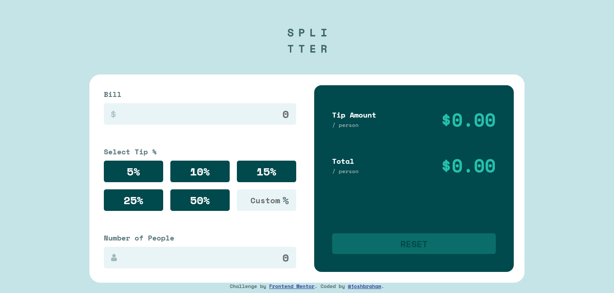

# Frontend Mentor - Tip calculator app solution

This is a solution to the [Tip calculator app challenge on Frontend Mentor](https://www.frontendmentor.io/challenges/tip-calculator-app-ugJNGbJUX).

### **[Live Site Link](https://jbhm-tip-calculator-app.netlify.app/)**

---

## Overview

### The challenge

Users should be able to:

-   View the optimal layout for the app depending on their device's screen size
-   See hover states for all interactive elements on the page
-   Calculate the correct tip and total cost of the bill per person

### Screenshot

## My process

### Built with

-   Semantic HTML5 markup
-   CSS custom properties
-   Flexbox
-   CSS Grid
-   Mobile-first workflow
-   Vanilla JavaScript

### What I learned

Vanilla JS becomes a headache once you try to do anything marginally complex. I'm using react next time.

## Author

-   Frontend Mentor - [@joshbraham](https://www.frontendmentor.io/profile/joshbraham)
